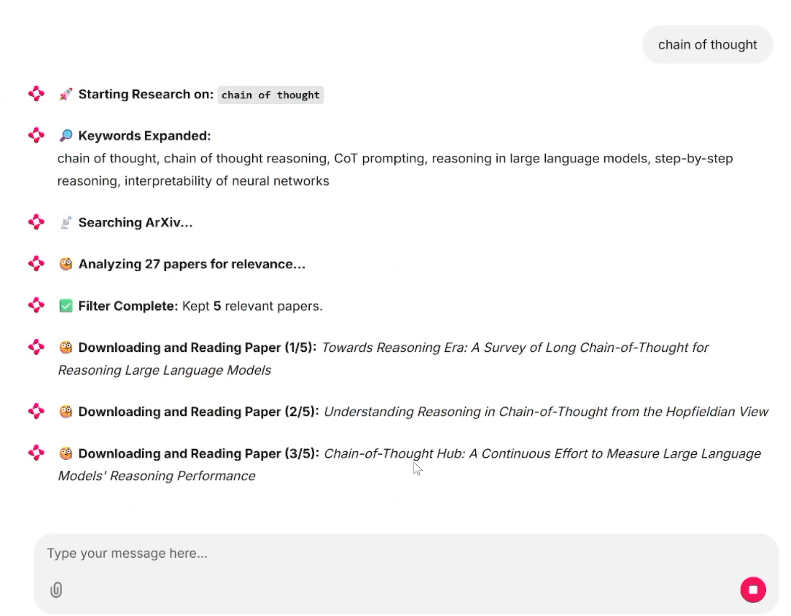
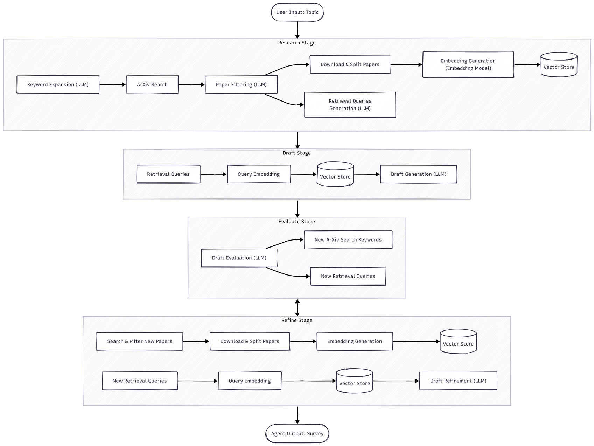

# Survey agent

An AI agent that automatically searches and organizes recent and
relevant papers to generate a traceable survey based on user-provided topic.

## Screenshot


The example result from the generated "Chain of thought" survey could be found [here](assets/chain_of_thought_survey.md).

## How to run the survey agent

This project use `uv` as project manager. Please make sure `uv` is installed first!

To sync project dependencies at the first run, type:

```bash
uv sync
```

You also need to configure Deepseek API in `config.py` first.

To run the project in server (webpage) mode, type:
```bash
uv run chainlit run app.py
```

To run the project in console mode, type:
```bash
uv run main.py
```

## Motivation

- As interdisciplinary research becomes more common, students often encounter unfamiliar concepts and struggle to know where to start. Searching for papers, filtering results, and reading large numbers of PDFs can be time-consuming and discouraging.

- Our Goal is to design an AI agent that automatically searches and organizes recent and relevant papers to generate a traceable survey based on user-provided topic.

- Objectives:
  - Retrieve the most recent and relevant academic papers from ArXiv.
  - Generated surveys contain accurate, verifiable citations and eliminate hallucinations.
  - Iterative drafting, self-evaluating and refining for comprehensive survey.


## Problem Definition & Solution

- Paper may not relevant:
  - Problem: Keyword searches on ArXiv often return a large number of results mixed with many irrelevant papers.
  - Solution: Use LLM to filter out irrelevant literature based on abstracts before processing the full text.

- LLM Hallucination:
  - Problem: LLMs may generate statements or references that are not supported by real academic sources.
  - Solution: The generation process must be grounded in a real database to ensure 100% citation accuracy.
  - Problem: RAG relies heavily on retrieval accuracy. “garbage in, garbage out”.
  - Solution: Agentic RAG. Use LLM to generate retrieval queries. Introduce iterative self-evaluating and refining processes.

- Limitations of LLM’s “One-Shot” Generation:
  - Problem: A single generation often leads to incomplete coverage and shallow analysis of the research topic.
  - Solution: Introduce iterative drafting, self-evaluating and refining loops.

## Architecture & Implementation Details

### Tech Stack

- Agent Framework:
  - LangChain & LangGraph
- PDF Parser:
  - Docling
- Vector Database:
  - ChromaDB
- LLM:
  - Deepseek V3.2 (deepseek-chat)
- Embedding Model:
  - sentence-transformers/all-MiniLM-L6-v2
- Paper Source:
  - ArXiv API
- Frontend Interface:
  - Chainlit
- Package & project manager:
  - uv

### Agentic RAG

The system is modeled as a state machine with four core stages.

- Research Stage
- Draft Stage
- Evaluation Stage
- Refinement Stage




#### Research Stage

1. Uses LLM to expand the input topic into multiple search keywords.
2. Queries the ArXiv API to retrieve a candidate list of papers.
3. Uses LLM to filter papers based on their abstracts.
4. Generates retrieval queries from the selected abstracts using an LLM.
5. Downloads PDFs and parses them, and chunks the text.
6. Generates embeddings, and stores them in a vector database.


#### Draft Stage

1. Retrieves relevant chunks from the vector database using LLM-generated queries.
2. Generates an initial survey draft based on the retrieved content.

#### Evaluation Stage

1. Evaluates the draft using an LLM along multiple dimensions, including coverage, depth, balance, and structure.
2. If the draft meets quality requirements, the survey is returned to the user.
3. Otherwise, the LLM identifies missing aspects and generates new paper search keywords and retrieval queries.

#### Refinement Stage

1. Searches for and filters additional papers using the newly generated keywords.
2. Processes and indexes the new papers into the vector database.
3. Retrieves relevant content using the updated queries.
4. Refines the survey draft based on the newly retrieved information.
5. Go to Evaluation Stage again, loop until it meets the required quality. (There is also a max iteration)

### Retrieval-Constrained Generation

- Paper processing phase:
  - Paper metadata is maintained in the AgentState and embedded together with document chunks into the vector store.

- Retrieval phase:
  - Retrieved documents are assigned citation indices based on their metadata.

- Generation phase:
  - The LLM is restricted to generate content only from retrieved documents, using citation indices instead of a reference list.

- Post-processing:
  - Citation indices are resolved back to metadata to construct the final reference list.

